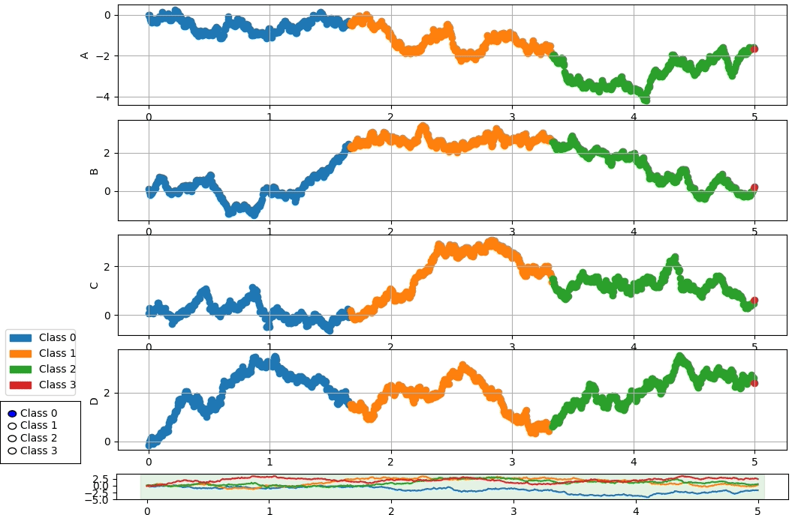

# Simple data segmenter



## Install

```bash
sudo apt install python3-tk
pip install git+https://github.com/XavierTolza/python-timeseries-segmenter.git
```
Or add `git+https://github.com/XavierTolza/python-timeseries-segmenter.git` to you `requirements.txt`:

## Usage

Inputs are pandas dataframe with x axis as index. A plot will be drawn for each column and you need to specify the class with a column labelled *"class"*
See the example below:
```python
# Generate sample data
n_values = 1000
n_classes = 4
columns = "A,B,C,D".split(",")
data = np.cumsum(np.random.normal(0, .1, (n_values, len(columns))), 0)
data = DataFrame(data,
                 index=np.linspace(0, 5, n_values), columns=columns)
# Now data is correct, generate class for each sample
classes = np.array(["Class %i" % i for i in range(n_classes)])[np.linspace(0, n_classes-1, n_values).astype(int)]
data["class"] = classes

# Run the UI
s = dfs.Segmenter(data)
res = s.run()

# The result is the same dataframe as input, but with classes updated
print(res)
```

## Dependencies
Python 3.6, tested on Linux Ubuntu 18.04
- python-tk package
- See `requirements.txt` for other dependencies